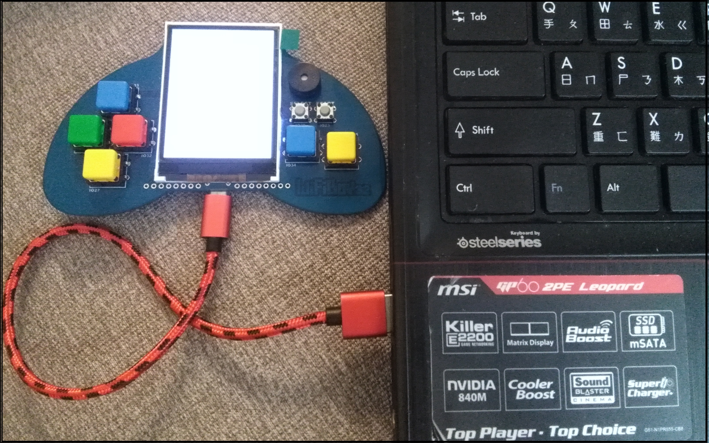
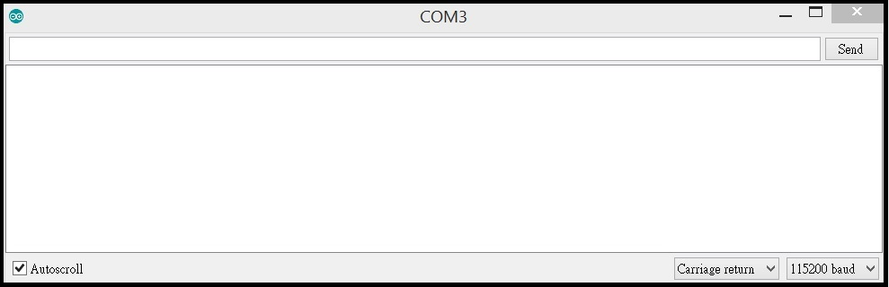
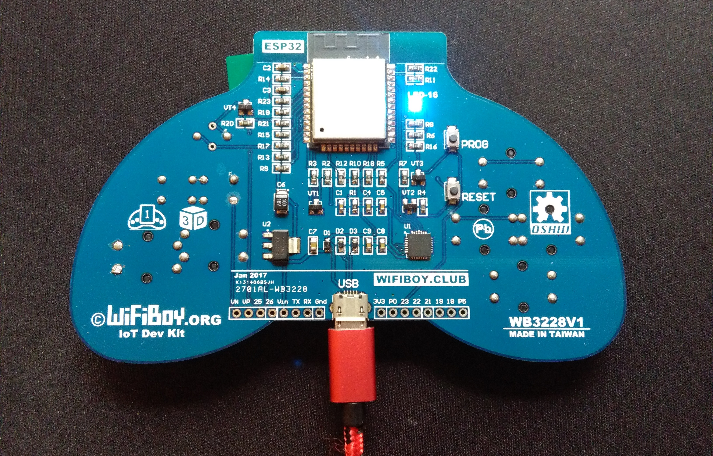
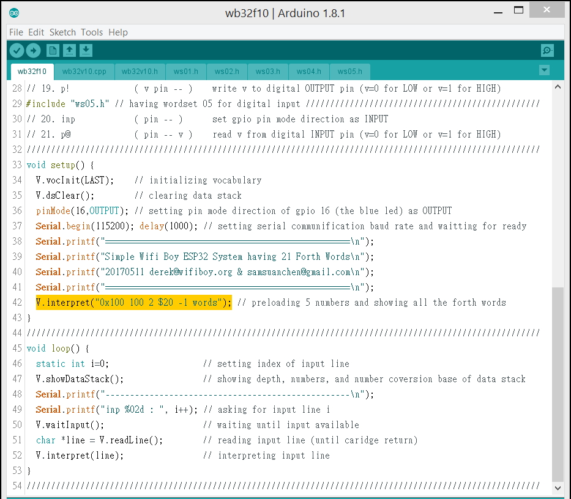
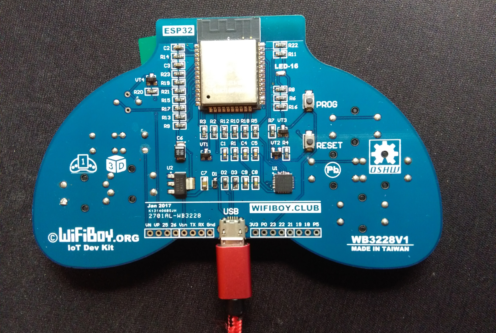

# wb32f10 -- Wifi Boy ESP32 Forth proj 010

## Simple Wifi Boy ESP32 System Having 21 Forth Primitive Words

### A. Getting start
1.Connect Wifi Boy ESP32 to USB COM port.

2.Double lick wb32f10.ino in the wb32f10 project directory.

3.The source code of wb32f10.ino will be shown.

4.Then we could open the Serial Monitor by select the submenu item.

5.The empty Serial Monitor is opened.

6.Then we could click the arrow to build, burn, and run the code.

Once wb32f10 started, the blue led on the back of wifi boy esp32 will be turned on.

And the following message will be shown on the Serial Monitor.

    ets Jun  8 2016 00:22:57
    
    rst:0x1 (POWERON_RESET),boot:0x13 (SPI_FAST_FLASH_BOOT)
    ets Jun  8 2016 00:22:57
    
    rst:0x10 (RTCWDT_RTC_RESET),boot:0x13 (SPI_FAST_FLASH_BOOT)
    configsip: 0, SPIWP:0x00
    clk_drv:0x00,q_drv:0x00,d_drv:0x00,cs0_drv:0x00,hd_drv:0x00,wp_drv:0x00
    mode:DIO, clock div:1
    load:0x3fff0008,len:8
    load:0x3fff0010,len:1848
    load:0x40078000,len:6712
    load:0x40080000,len:252
    entry 0x40080034
    ==================================================
    Simple WifiBoy ESP 32 Forth System having 21 Words
    20170510 derek@wifiboy.org & samsuanchen@gmail.com
    ==================================================
    
    ms p@ p! lo hi inp out led dump see words / - * + base@ base! hex dec oct bin
    < dsDepth 5 [ 256 100 2 32 -1 ] base10 >
    --------------------------------------------------
    inp 00 :
21 forth words and 5 decimal numbers in bracket are shown and then waiting for input. Preloading numbers and asking to show the word names are just because of the  statement **V.interpret("0x100 100 2 $20 -1 words")** in the code setup as follows.

Once we have numbers on the data stack (shown in bracket), we could try the forth word **bin** to change the conversion base from 10 to 2.

	01. bin ( -- ) set number conversion base B=2
		inp 00 : bin
		<dsDepth 5 [ 100000000 1100100 10 100000 11111111111111111111111111111111 ] base2 >

We could try the forth word **oct** to change the number conversion base to 8.

	02. oct ( -- ) set number conversion base B=8
		inp 01 : oct
		<dsDepth 5 [ 400 144 2 40 37777777777 ] base8 >

We could try the forth word **dec** to change the number conversion base to 10.

	03. dec ( -- ) set number conversion base B=10
		inp 02 : dec
		<dsDepth 5 [ 256 100 2 32 -1 ] base10 >

We could try the forth word **hex** to change the number conversion base to 16.

	04. hex ( -- ) set number conversion base B=16
		inp 03 : hex
		<dsDepth 5 [ 100 64 2 20 ffffffff ] base16 >

How about if we would try to set the base to decimal 12. We could try "**dec 12 base!**".

	05. base! ( b -- ) set number conversion base B=b
		inp 04 : dec 12 base!
		< dsDepth 5 [ 194 84 2 28 9ba461593 ] base12 >

Now we could try the forth word **base@** to get the number conversion base B. One more number "10" will be shown in bracket (note that decimal 12 is now shown as 10 in base12).

	06. base@ ( -- B ) get number conversion base B
		inp 05 : base@
		< dsDepth 6 [ .. 84 2 28 9ba461593 10 ] base12 >

Entering "**2 - base!**" will decrease the decimal 12 (on data stack) by 2, then set the result (decimal 10) as the number conversion base B. 

		inp 06 : 2 - base!
		< dsDepth 5 [ 256 100 2 32 -1 ] base10 >

Now we might try some arithmetic operation. For example, "+" will do addition, pop the last two numbers 32 and -1 from the top of data stack, add them, and push back the sum 31 to the top of data stack.

	07. + ( a b -- a+b ) a add b
		inp 07 : +
		<dsDepth 4 [ 256 100 2 31 ] base10 >

Input "*" will do multiplication, pop two numbers 2 and 31, push back the product 62.

	08. * ( a b -- a*b ) a multiply b
		inp 08 : *
		<dsDepth 3 [ 256 100 62 ] base10 >

Input "-" will do subtraction, pop two numbers 100 and 62, push back the difference 38.

	09. - ( a b -- a-b ) a subtract b
		inp 09 : -
		<dsDepth 2 [ 256 38 ] base10 >

Input "/" will do division, pop two numbers 256 and 38, push back the quotient 6.

	10. / ( a b -- a/b ) a divide b
		inp 10 : /
		<dsDepth 1 [ 6 ] base10 >

Up to now, we have introduced 10 forth words, bin oct dec hex base! base@ + * - /. Next. we might try "words". Actually, this is the forth word that had been used to show all the 21 words defined, in the beginning.

	11. words ( -- ) show all forth word names
		inp 11 : words
		ms p@ p! lo hi inp out led dump see words / - * + base@ base! hex dec oct bin
		< dsDepth 1 [ 6 ] base10 >

However alternatively, we could have extra string after "words", for example "words e". That shows only the forth word names including the given string "e".

	12. words <string> ( -- ) show all forth word names including given string
		inp 12 : words e
		led see base@ base! hex dec
		< dsDepth 1 [ 6 ] base10 >

The forth word see is used to show the information of a given word. For example "see dec" will show the information of the forth word dec as follows (for each forth word, 3 pointers are used to construct the word). prev is pointing to previous forth word, name is pointing to its name string, code is pointing to the function code to execute. 

	13. see <name> ( -- ) see the word of given name
		inp 13 : see dec
		----------------------
		3f4012ec prev 3f4012f8
		3f4012f0 name 3f4011f7 dec
		3f4012f4 code 400d06d0
		forth primative word dec
		< dsDepth 1 [ 6 ] base10 >

The forth word dump is defined to show content of n memory cells at given address. For example, input "0x3f4012ec 9 dump" will show 9 memory cells at 0x3f4012ec as follows.

	14. dump ( a n -- ) show n cells at address a
		inp 14 : 0x3f4012ec 9 dump
		3f4012ec : 3f4012f8 3f4011f7 400d06d0 3f401304 : f8 12 40 3f f7 11 40 3f d0 06 0d 40 04 13 40 3f : __@?__@?___@__@?
		3f4012fc : 3f4011fb 400d06c0 00000000 3f4011ff : fb 11 40 3f c0 06 0d 40 00 00 00 00 ff 11 40 3f : __@?___@....__@?
		3f40130c : 400d06b0                            : b0 06 0d 40                                     : ___@            
		< dsDepth 1 [ 6 ] base10 >

In the following, let's try to turn off the blue led on the back of wifi boy esp32. The way to turn off the led is to pull up the led pin to electric level HIGH. The forth word **led** will give the number 16, the gpio pin number of the blue led. And the forth word **hi** will pull up the led pin to electric level HIGH. So we could input "**led hi**" to turn off the blue led.

	15.	led ( -- 16  ) give decimal 16 (gpio pin number of the blue led)
	16.	hi  ( pin -- ) pull up digital OUTPUT pin to electric level HIGH
		inp 15 : led hi
		< dsDepth 1 [ 6 ] base10 >

The forth word lo will pull down the led pin to electric level LOW.  So we could input "**led lo**" to turn on the blue led.

	17.	lo  ( pin -- ) pull down digital OUTPUT pin to electric level LOW
		inp 16 : led lo
		< dsDepth 1 [ 6 ] base10 >

The forth word **ms** could be used to wait for give number of milliseconds. And hence, we could input "led lo 250 ms led hi 250 ms led lo 250 ms led hi 250 ms" to on/off the led 4 times in two seconds.

	18.	ms  ( n -- ) wait for n milliseconds
		inp 17 : led lo 250 ms led hi 250 ms led lo 250 ms led hi 250 ms led lo 250 ms led hi 250 ms led lo 250 ms led hi 250 ms
		< dsDepth 1 [ 6 ] base10 >

Normally, the forth word **out** should be used to set gpio pin mode direction as OUTPUT before writing HIGH/LOW to the digital OUTPUT pin. In the same way, the forth word **inp** should be used to set gpio pin mode direction as INPUT before reading a digital INPUT pin. On wifi boy esp32, 8 buttons could be tried, namely gpio 17, 23, 27, 32, 33, 34, 39. 

	19.	out ( pin -- ) set gpio pin mode direction as OUTPUT
	20.	inp ( pin -- ) set gpio pin mode direction as INPUT
	21.	p! ( v pin -- ) write v to digital OUTPUT pin (v=0 for LOW or v=1 for HIGH)
	22.	p@ ( pin -- v ) read v from digital INPUT pin (v=0 for LOW or v=1 for HIGH)

Alternatively, we could use "1 16 p!" to turn off or "0 16 p!" to turn on the blue led. 

### B. Intention of project wb32f10

01. Forth Promotion

02. Rapid Prototyping

03. More Resources As Much As Possible

04. More Top Down

05. Less Bottom Up

06. More Application Programming

07. Less System Programming

### C. Implementation of project wb32f10

01. Collect Characters To Terminal Input Buffer

02. Parse Token From Terminal Input Buffer

03. Convert Number to Digits In Given Base

04. Convert Digits to Number In Given Base

05. Search Forth Word In Forth Vocabulary

06. See Forth Word

07. Dump Memory Content of Forth System

### D. Extention of project wb32f10

01. Add More Forth Words Into Forth Vocabulary

02. The Constructs Of Forth Branchs And Loops

03. Implementation of Colon and Semi Colon
