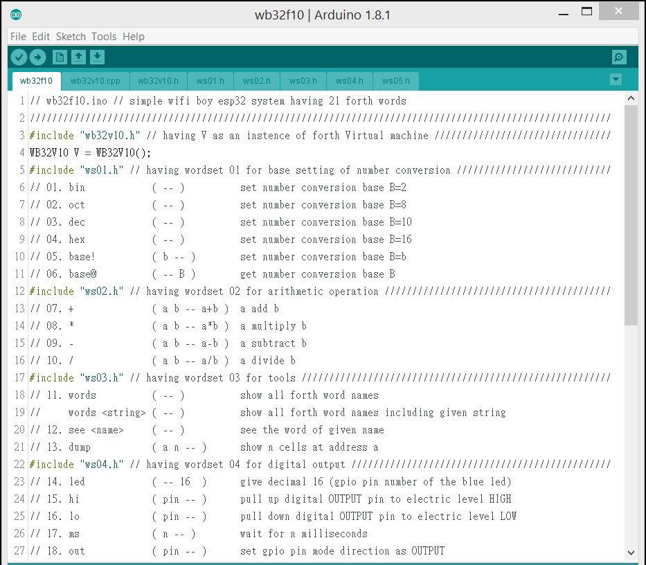

# wb32f10 -- wifiBoy esp32 forth proj 010

## Simple WifiBoy esp32 System Having 21 Forth Primative Words

### A. Getting start
1.Connect Wifi Boy ESP32 to USB socket.

2.Double lick wb32f10.ino in the project directory.

3.The source code of wb32f10.ino will be shown. Notice that the first line is **#include "wb32v10.h"** so we need move the directory wb32f10\libraries\wb32v10 to ardrino\libraries, at the first time. 

4.Then we could open the Serial Moniter by select the submenu item.

5.The empty Serial Moniter is opened.

6.Then we could click the arrow to build, burn, and run the code.

Once wb32f10 started, the following message will be shown on the Serial Moniter.

    ets Jun  8 2016 00:22:57
    
    rst:0x1 (POWERON_RESET),boot:0x13 (SPI_FAST_FLASH_BOOT)
    ets Jun  8 2016 00:22:57
    
    rst:0x10 (RTCWDT_RTC_RESET),boot:0x13 (SPI_FAST_FLASH_BOOT)
    configsip: 0, SPIWP:0x00
    clk_drv:0x00,q_drv:0x00,d_drv:0x00,cs0_drv:0x00,hd_drv:0x00,wp_drv:0x00
    mode:DIO, clock div:1
    load:0x3fff0008,len:8
    load:0x3fff0010,len:1848
    load:0x40078000,len:6712
    load:0x40080000,len:252
    entry 0x40080034
    ==================================================
    Simple WifiBoy ESP 32 Forth System having 21 Words
    20170510 derek@wifiboy.org & samsuanchen@gmail.com
    ==================================================
    
    ms p@ p! lo hi inp out led dump see words / - * + base@ base! hex dec oct bin
    < dsDepth 5 [ 256 100 2 32 -1 ] base10 >
    --------------------------------------------------
    inp 00 :
The names of 21 forth words and 5 decimal numbers (in bracket) on the data stack are shown and then waiting for our input. These 5 numbers were preloaded via  **V.interpret("0x100 100 2 $20 -1 words");** in the code setup as follows.

Once we have numbers on the data stack, we could try the forth word **bin** to change the covertion base from 10 to 2.

	01. bin ( -- ) set number convertion base B=2
		inp 01 : bin
		<dsDepth 5 [ 100000000 1100100 10 100000 11111111111111111111111111111111 ] base2 >

We could try the forth word **oct** to change the number covertion base to 8.

	02. oct ( -- ) set number convertion base B=8
		inp 02 : oct
		<dsDepth 5 [ 400 144 2 40 37777777777 ] base8 >

We could try the forth word **dec** to change the number covertion base to 10.

	03. dec ( -- ) set number convertion base B=10
		inp 03 : dec
		<dsDepth 5 [ 256 100 2 32 -1 ] base10 >

We could try the forth word **hex** to change the number covertion base to 16.

	04. hex ( -- ) set number convertion base B=16
		inp 04 : hex
		<dsDepth 5 [ 100 64 2 20 ffffffff ] base16 >

Now, we could try some other arithmatic operations. For example, input "+" will do addition, pop last two numbers 32 and -1 from data stack, add them, and push back the sum 31 to data stack.

	05. + ( a b -- a+b ) a add b
		inp 05 : +
		<dsDepth 4 [ 100 64 2 1f ] base16 >

Input "*" will do multiplication, pop two numbers 2 and 31, push back the product 62.

	06. * ( a b -- a*b ) a multiply b
		inp 06 : *
		<dsDepth 3 [ 00 64 3e ] base16 >

Input "-" will do subtraction, pop two numbers 100 and 62, push back the difference 38.

	07. - ( a b -- a-b ) a subtract b
		inp 07 : -
		<dsDepth 2 [ 100 26 ] base16 >

Input "/" will do division, pop two numbers 256 and 38, push back the quotient 6.

	08. / ( a b -- a/b ) a divide b
		inp 08 : /
		<dsDepth 1 [ 6 ] base16 >

Up to now, we have introduced 8 forth words, bin oct dec hex + * - /. The next will be "words". Input "words" will show all the 11 words that are already defined.

	09. words ( -- ) show all forth word names
		inp 09 : words
		dump see words / - * + hex dec oct bin
		< dsDepth 1 [ 6 ] base16 >

Alternatively, we could give extra string after "words", for example "words e". That shows only 3 forth word names, see hex dec, those include given string "e".

	10. words <string> ( -- ) show all forth word names including given string
		inp 10 : words e
		see hex dec
		< dsDepth 1 [ 6 ] base16 >

The word see is used to show the infomation of a given word. For example "see dec" will show the infomation of the forth word dec as follows. 3 pointers are used to construct each forth word, the pointer prev points to previous forth word, the poiter name points its name string, the pointer code points to the function code to execute. 

	11. see <name> ( -- ) see the word of given name
		inp 11 : see dec
		----------------------
		3f401338 prev 3f401344
		3f40133c name 3f4012cb dec
		3f401340 code 400d06f8
		forth primative word dec 
		< dsDepth 1 [ 6 ] base16 >

The last word dump is defined to show memory content of n cells at given address. For example, input "3f401338 9 dump" will show 9 memory cells at 0x3f401338 as follows.

	12. dump ( a n -- ) show n cells at address a
		inp 12 : 3f401338 9 dump
		3f401338 : 3f401344 : 3f4012cb : 400d06f8 : 3f401350 : 44 : 13 : 40 : 3f : cb : 12 : 40 : 3f : f8 : 06 : 0d : 40 : 50 : 13 : 40 : 3f : D_@?__@?___@P_@?
		3f401348 : 3f4012cf : 400d06ec : 00000000 : 3f4012d3 : cf : 12 : 40 : 3f : ec : 06 : 0d : 40 : 00 : 00 : 00 : 00 : d3 : 12 : 40 : 3f : __@?___@....__@?
		3f401358 : 400d06e0 :          :          :          : e0 : 06 : 0d : 40 :    :    :    :    :    :    :    :    :    :    :    :    : ___@
		< dsDepth 1 [ 6 ] base10 >

### B. Ideas of project wb32f10

01. Forth Promotion

02. Rapid Prototyping

03. More Resources As Much As Possible

04. More Top Down

05. Less Bottom Up

06. More Application Programming

07. Less System Programming

### C. Implementation of project wb32f10

01. Collect Characters To Terminal Input Buffer

02. Parse Token From Terminal Input Buffer

03. Convert Number to Digits In Given Base

04. Convert Digits to Number In Given Base

05. Search Forth Word In Forth Vocabulary

06. See Forth Word

07. Dump Memory Content of Forth System

### D. Extention of project wb32f10

01. Add More Forth Words Into Forth Vocabulary

02. The Constructs Of Forth Branchs And Loops

03. Implementation of Colon and Semi Colon
